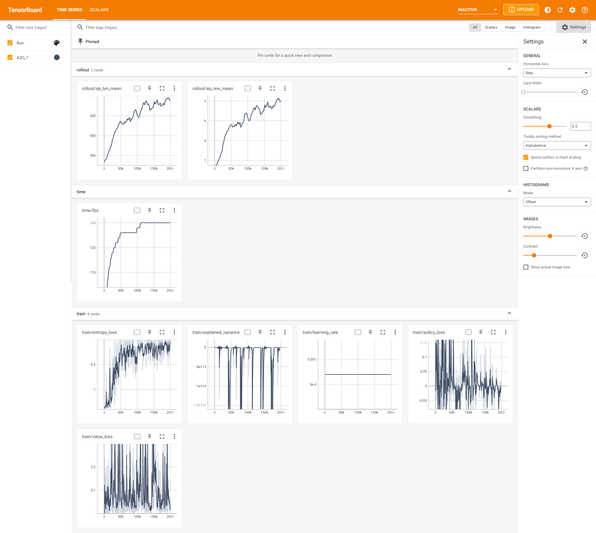

# A2C with 200000 steps

## Reference
[Asynchronous Methods for Deep Reinforcement Learning](https://arxiv.org/abs/1602.01783)

## Parameters
Default parameters as per [Stable Baselines](https://stable-baselines3.readthedocs.io/en/master/modules/a2c.html)

## Performance logs

## Renders
1. Random  

2. Modelled  

