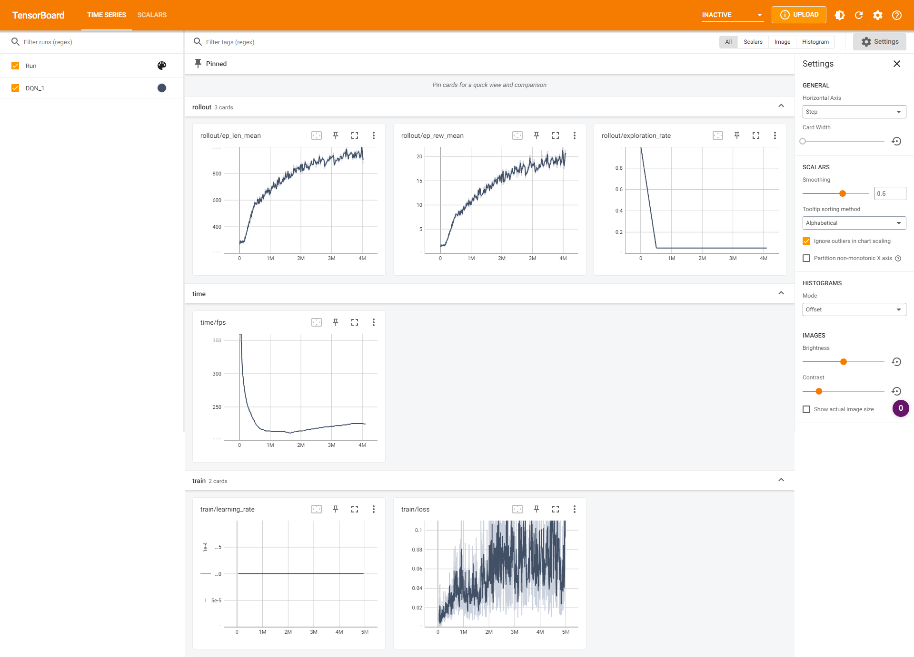
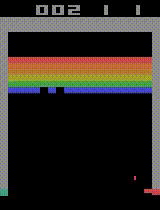

# DQN with 5M steps

## Reference
[Playing Atari with Deep Reinforcement Learning](https://arxiv.org/abs/1312.5602)

## Parameters
Default parameters as per [Stable Baselines](https://stable-baselines3.readthedocs.io/en/master/modules/dqn.html)\
buffer_relay parameter set to 39500 instead of 1M to allow for limitations in graphics card memory

## Performance logs

## Renders
1. Random  

2. Modelled  

