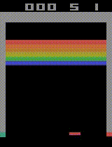

# Breakout

## Libraries:
### Stable Baselines:
https://stable-baselines3.readthedocs.io/en/master/index.html

### Stable Baselines contrib
https://sb3-contrib.readthedocs.io/en/master/index.html

## Algorithms:
1. [PPO](https://stable-baselines3.readthedocs.io/en/master/modules/ppo.html)
2. [Recurrent PPO](https://sb3-contrib.readthedocs.io/en/master/modules/ppo_recurrent.html)
3. [TRPO](https://sb3-contrib.readthedocs.io/en/master/modules/trpo.html)
4. [A2C](https://stable-baselines3.readthedocs.io/en/master/modules/a2c.html)
5. [DQN](https://stable-baselines3.readthedocs.io/en/master/modules/dqn.html)
6. [QR-DQN](https://sb3-contrib.readthedocs.io/en/master/modules/qrdqn.html)

## Description:
Another famous Atari game. The dynamics are similar to pong: You move a paddle and hit the ball in a brick wall at the top of the screen. Your goal is to destroy the brick wall. You can try to break through the wall and let the ball wreak havoc on the other side, all on its own! You have five lives. Detailed documentation can be found on the AtariAge page.

## Training steps:
1. Inital exploration across algorithms - 200K
2. Final training for PPO and RecurrentPPO - 5M

## Results:
### Randomly acting agent:

### Modelled agent

